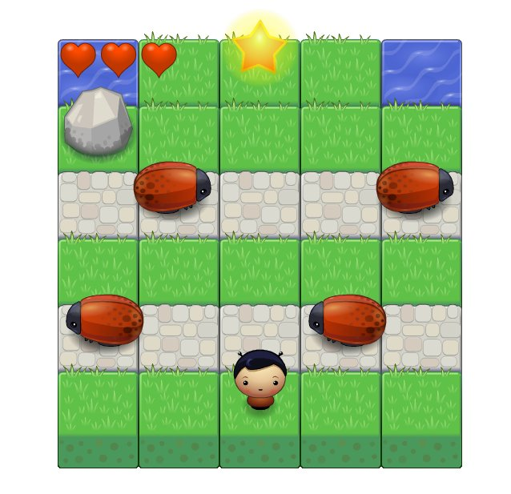

'Frogger' style arcade game
===========================

A JavaScript arcade game in the style of Frogger.

[Play a hosted version of the game](https://hexaglot.github.io/road-crossing/index.html)

To run the game locally, clone the repository and open index.html.

The aim of the game is to get the player to the star without touching the enemy
bugs. You have three lives to complete all the levels.

engine.js has been heavily modified to make adding menus and multiple levels
simple. The fixed allEnemies and player variables have been removed as the fixed
structure made it harder to extend the game. As a result of theses changes
Engine.js now passes most of its functionality on to Objects defined in app.js.
The game switches between Scene and Menu objects which implement different game
states.

There is a Player and Enemy object - both quite simple. There are a few helper
objects:

- Vec - a simple 2D vector object which really only keeps an x and y
value

- Sprite - holds an image with a position, and can draw itself. It is
used for most game objects 

- Animation, Tween, Timer objects - these implement
a simple tweening system isnpired by the flux library use in Lua's Love game
system. I had planed to use this to add more effects to the game but actually
they are probably not really needed. The timer is used to spawn vehicles in
patterns.

- Level object is a conainer for map data. It holds the position of background
and foreground sprites, can load itself from the primitive level descriptions
used to design the levels. It uses the EnemyEmitter object to describe where and
how often enemy vehicles are created. It can also tell you if a player can step
on a square.

- Menu class presents the ugly, simplistic menus. If I had more time I would
focus on making these more attractive.

- Scene object stores the game objects and logic. Most of the work is done in
the update method - player movement and enemy collisions are both handled here.
It made more sense to put collision response outside the player object as it
seperates concerns better.

If I had more time I would:

- Make better use of the tween object. Few animations are actually implemented
and its not pulling its weight atm. 
- Tidy the game engine state management, init() should probably be called enter() and a leave() function would be handy
id. 
- Improve the menus, they are ugly and dont really add much to the
experience. 
- Make some better levels, or maybe change the player movement to
make the game a bit more fun. 
- split things into more than one file!
- Improve the documentation quite a bit.

